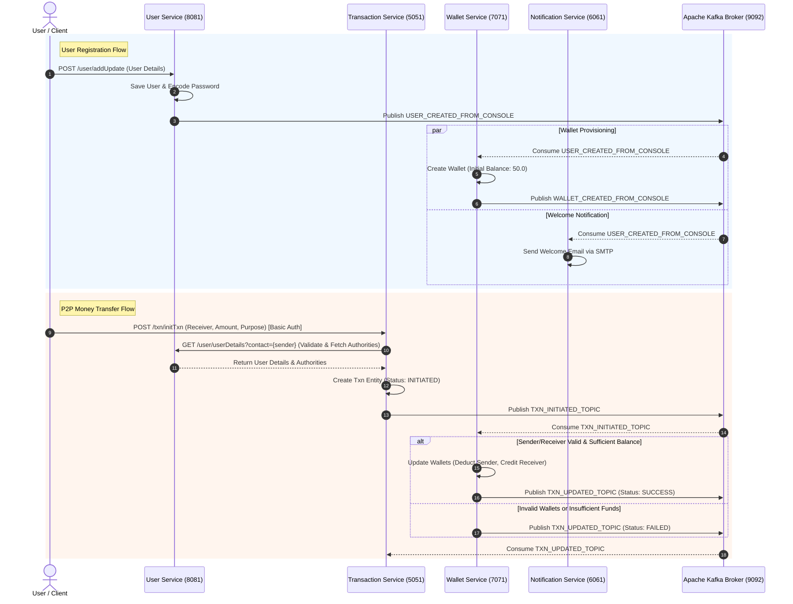

# E-Wallet Distributed Microservices Platform

[](https://www.oracle.com/java/)
[](https://spring.io/projects/spring-boot)
[](https://kafka.apache.org/)
[](https://www.mysql.com/)
[](LICENSE)

An event-driven digital e-wallet application  built with **Java 17**, **Spring Boot 3.3.1**, **Apache Kafka**, **Spring Security**, and **MySQL**. The system is architected as a distributed multi-module microservice network to handle user onboarding, wallet creation, instant peer-to-peer (P2P) fund transfers, transaction auditing, and real-time email notification dispatching.

---

## 🏛 System Architecture & Event-Driven Workflow

The platform leverages **Apache Kafka** for asynchronous inter-service communication and eventual consistency across service boundaries.



---

## 🧩 Service Modules Overview

| Service Name | Port | Description | Database / Storage | Key Responsibilities |
| :--- | :---: | :--- | :--- | :--- |
| **`User-Service`** | `8081` | User onboarding & identity management | MySQL (`JBDL_EWALLET`) | User registration, authentication, authority management, and user lookup. |
| **`Wallet-Service`** | `7071` | Digital wallet & ledger manager | MySQL (`JBDL_EWALLET`) | Auto-creates wallets with welcome bonus (`50.0`), validates funds, updates balances. |
| **`Transaction-Service`** | `5051` | P2P transfer orchestration | MySQL (`JBDL_EWALLET`) | Initiates transaction requests, validates caller identity via User-Service, and consumes transaction update events. |
| **`Notification-service`** | `6061` | Communication & Email dispatch | SMTP / Mailtrap | Listens for system events and emails confirmation/welcome notices to users. |
| **`utils`** | N/A | Shared utility library | Shared Module | Holds common constants, DTOs, Kafka topics, and shared enums (`UserIdentifier`). |

---

## 🚀 Key Features

- **Decoupled Architecture**: Distributed microservices built with a shared Maven parent POM for easy dependency management.
- **Event-Driven Messaging**: Asynchronous event publishing and consumption via Kafka topics (`USER_CREATED_FROM_CONSOLE`, `WALLET_CREATED_FROM_CONSOLE`, `TXN_INITIATED_TOPIC`, `TXN_UPDATED_TOPIC`).
- **Role-Based Security**: Spring Security Basic Auth integration with custom authority verification (`USER`, `ADMIN`, `SERVICE`).
- **Automatic Wallet Provisioning**: Every newly registered user automatically gets an active wallet pre-funded with initial credits.
- **Transactional Wallet Updates**: Validates sender balance and receiver details before updating wallet balances within a database transaction.
- **Email Notifications**: Automated mail notifications powered by `JavaMailSender` and SMTP configuration.

---

## 🛠 Tech Stack

- **Core**: Java 17, Spring Boot 3.3.1
- **Security**: Spring Security (DAO Authentication Provider, BCrypt Password Encoder)
- **Data & Persistence**: Spring Data JPA, Hibernate, MySQL 8.x
- **Event Streaming**: Spring Kafka, Apache Kafka Broker
- **Messaging Formats**: JSON (Jackson `ObjectMapper`, `json-simple`)
- **Email**: Spring Boot Starter Mail (SMTP)
- **Utilities**: Project Lombok, Maven Multi-Module Packaging

---

## 🚦 Getting Started

### Prerequisites

Ensure you have the following installed on your machine:
- **JDK 17** or higher
- **Apache Maven 3.8+**
- **MySQL Server 8.0+** running on `localhost:3306` (Default user: `[DATABASE_USERNAME]`, password: `[DATABASE_PASSWORD]`)
- **Apache Kafka & Zookeeper** running on `localhost:9092`

### 1. Database Setup
MySQL database will be automatically created on application boot via the connection string:
```properties
spring.datasource.url=jdbc:mysql://localhost:3306/JBDL_EWALLET?createDatabaseIfNotExist=true
```

### 2. Start Kafka Broker
Start Zookeeper and Apache Kafka broker locally:
```bash
# Start Zookeeper
zookeeper-server-start.sh config/zookeeper.properties

# Start Kafka Server
kafka-server-start.sh config/server.properties
```

### 3. Build Project
Clone the repository and build all microservices using Maven:
```bash
git clone https://github.com/Puranjit-g/EWallet_JBDL.git
cd EWallet_JBDL-main
mvn clean install
```

### 4. Run Microservices
Launch each service in separate terminal sessions or run them via your IDE:

```bash
# Start User Service
mvn spring-boot:run -pl User-Service

# Start Wallet Service
mvn spring-boot:run -pl Wallet-Service

# Start Transaction Service
mvn spring-boot:run -pl Transaction-Service

# Start Notification Service
mvn spring-boot:run -pl Notification-service
```

---

## 📡 API Endpoints & Usage Guide

### 1. User Service (`http://localhost:8081`)

#### **Register / Update User**
- **Endpoint**: `POST /user/addUpdate`
- **Headers**: `Content-Type: application/json`
- **Request Body**:
```json
{
  "name": "John Doe",
  "email": "john.doe@example.com",
  "contact": "+919876543210",
  "password": "Password123!",
  "address": "123 Tech Park, Bangalore",
  "dob": "1995-08-15",
  "identifier": "PAN",
  "userIdentifierValue": "ABCDE1234F"
}
```
- **Response**: `200 OK` (Returns created User object with `pk`, `createdOn`, etc.)

---

### 2. Transaction Service (`http://localhost:5051`)

#### **Initiate Fund Transfer**
- **Endpoint**: `POST /txn/initTxn`
- **Security**: Basic Auth (Username: Sender Contact Number, Password: User Password)
- **Query Parameters**:
  - `receiver`: Contact number of the recipient (e.g., `+919876543211`)
  - `amount`: Amount to transfer (e.g., `25.0`)
  - `purpose`: Reason for transfer (e.g., `Dinner split`)
- **cURL Request**:
```bash
curl -X POST "http://localhost:5051/txn/initTxn?receiver=%2B919876543211&amount=25.0&purpose=Dinner%20split" \
     -u "+919876543210:Password123!"
```
- **Response**: `200 OK` (Returns unique Transaction UUID, e.g., `c234a9b8-4d51-4e78-a12b-8910fedcba98`)

---

## ⚙️ Configuration Parameters

Key application properties can be configured in each service's `application.properties` file:

| Property | Default Value | Description |
| :--- | :--- | :--- |
| `server.port` | `8081` / `7071` / `5051` / `6061` | Embedded Tomcat HTTP server port |
| `spring.datasource.url` | `jdbc:mysql://localhost:3306/JBDL_EWALLET...` | MySQL JDBC connection URL |
| `user.creation.time.balance` | `50.0` | Initial wallet bonus credited upon user signup |
| `spring.kafka.producer.bootstrap-servers` | `localhost:9092` | Kafka broker host and port |
| `spring.mail.host` | `sandbox.smtp.mailtrap.io` | SMTP host for email notification service |

---

## 📜 Kafka Event Specifications

1. **`USER_CREATED_FROM_CONSOLE`**:
   Published by `User-Service` when a user registers.
   ```json
   {
     "user_id": 1,
     "contact": "+919876543210",
     "email": "john.doe@example.com",
     "name": "John Doe",
     "userIdentifier": "PAN",
     "userIdentifierValue": "ABCDE1234F"
   }
   ```

2. **`TXN_INITIATED_TOPIC`**:
   Published by `Transaction-Service` when a transfer is requested.
   ```json
   {
     "txnId": "uuid-v4-string",
     "sender": "+919876543210",
     "receiver": "+919876543211",
     "amount": 25.0,
     "purpose": "Dinner split",
     "status": "INITIATED"
   }
   ```

3. **`TXN_UPDATED_TOPIC`**:
   Published by `Wallet-Service` after updating wallet balances.
   ```json
   {
     "txnId": "uuid-v4-string",
     "status": "SUCCESS",
     "message": "Transaction completed successfully"
   }
   ```

---

## 📝 License

This project is open-source and available under the [MIT License](LICENSE).
